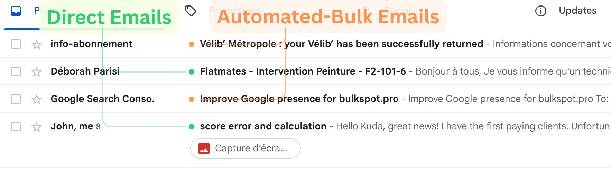

# BulkSpot

**See bulk email at a glance in Gmail.**

A Chrome extension that puts a colored chip next to every inbox row, so you can tell newsletters, marketing, and automated mail apart from real human email at a glance — without opening anything.

Header-only classification. Read-only by design. No backend, no analytics, no telemetry. The source you're looking at *is* the code that runs.



---

## Install (60 seconds, one-time setup required)

BulkSpot is not on the Chrome Web Store (see [Why this is open source](#why-this-is-open-source) below). Self-install is straightforward:

1. **Clone or download this repo**
   ```
   git clone https://github.com/YOUR_GITHUB_USERNAME/bulkspot.git
   ```

2. **Create a Google Cloud OAuth client ID** — full step-by-step in [extension/README.md](extension/README.md). Roughly: create a project → enable Gmail API → create OAuth client ID for "Chrome Extension" → paste your extension ID into Google Cloud, paste the resulting client ID into `extension/manifest.json`.

3. **Load the unpacked extension**
   - Open `chrome://extensions`
   - Enable Developer Mode (top right)
   - Click "Load unpacked" → select the `extension/` folder

4. **Open Gmail.** Click the BulkSpot icon in the toolbar → *Connect Gmail*. Approve the single permission (read message headers). Done.

Chips appear as you scroll. Orange = bulk, green = clean. Click a chip to whitelist a sender or domain.

---

## What it does

- **Reads only message headers**, never body content. The OAuth scope is `gmail.metadata` — narrowest available, doesn't grant access to message contents.
- **Classifies via header signals**: `List-Unsubscribe`, `Feedback-ID`, `Precedence`, ESP DKIM domains, VERP envelope-sender patterns, vendor `X-*` fingerprints, automated `From:` local parts, and more. Full rule list: [bulk_email_signs.md](bulk_email_signs.md).
- **Renders a visual overlay only.** Gmail itself is never written to — no labels applied, no read state changed, nothing archived or moved. Uninstall the extension and every trace is gone.
- **Whitelist + blocklist** for senders and domains. Click any chip to manage.

## Privacy

- The only network calls the extension makes are to `gmail.googleapis.com`.
- All classification runs in your browser. Headers never leave your machine.
- No analytics. No telemetry. No backend. No third-party scripts.
- All state lives in `chrome.storage.local`. Nothing syncs anywhere.

## Why this is open source

BulkSpot is free and will stay free.

The reason it lives on GitHub instead of the Chrome Web Store is that publishing a Gmail-scope extension on the Web Store requires CASA Tier 2 security certification — which costs real money for a free tool with no business model behind it. Open-sourcing means anyone with 60 seconds can self-install without going through that process.

If BulkSpot has saved you inbox time and you'd like to help cover CASA fees so non-technical users can eventually one-click install: **[donate link — coming soon]**.

No paywall, no feature gating, no tracking. Donations are appreciated, never required.

## How it works

```
Chrome extension (mail.google.com)
├── content/        MutationObserver on inbox rows
│                   sends thread IDs → background
│                   renders visual chip from classification result
│
├── background.js   chrome.identity → Gmail OAuth token
│                   Gmail API: threads.get format=metadata (headers only)
│                   classifier (header-only, pure JS)
│                   caches result in chrome.storage.local
│
└── popup/          on/off toggle, whitelist, blocklist, stats
```

Detailed flow and architecture: [CLAUDE.md](CLAUDE.md).

## Contributing

Contributions welcome — especially **false-positive reports**. Headers that should have been classified bulk but weren't (or vice versa) are the highest-leverage feedback for tuning the classifier.

See [CONTRIBUTING.md](CONTRIBUTING.md) for dev setup and PR guidelines.

## Security

Found a vulnerability? Please report privately, not via a public issue. See [SECURITY.md](SECURITY.md).

## About the developer

I'm Kuda — I build automations and developer tools. If BulkSpot is useful to you, check out my other work at [buildfast.studio](https://buildfast.studio).

Open to collaborations:
- Email: kuda@buildfast.studio
- LinkedIn: [linkedin.com/kudakuda](http://linkedin.com/kudakuda)

## License

Apache License 2.0. See [LICENSE](LICENSE). Use it, fork it, ship your own.
